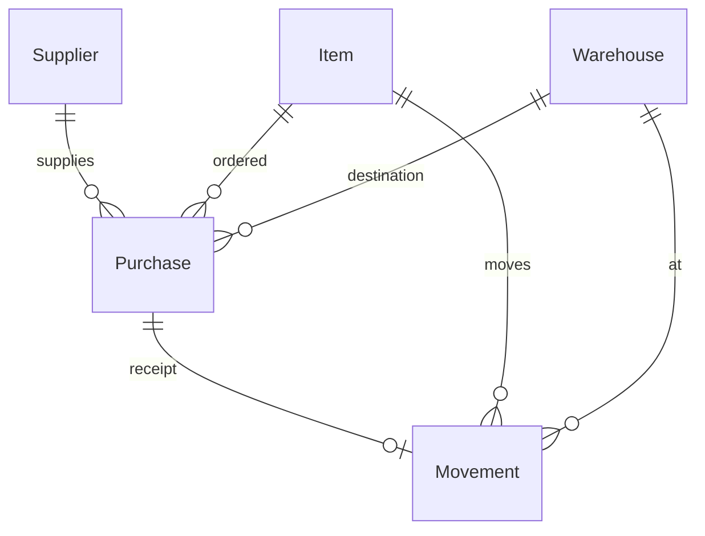

# Procurement

> Plan this with **tlc-plan**.
> Decisions below carry the literal shape - copy them, do not re-derive them.

## Situation

- Project: in active construction. Classroom ERP, ainda sem usuário de verdade.
- Decision: committed no `ROADMAP.md` — fase 5 Procurement, depois 6 Staff and Assignment, depois 7 Requisition. Esta discovery confirmou construir Procurement agora e deixar Staff para depois.
- In flight: Inventory acabou de fechar e estacionou Purchase/Supplier nesta fase. `DESIGN.md` restyle não commitado — só visual, não muda o seam. Nenhum design doc anterior.
- At stake: o seam Receipt ↔ Purchase e a língua em `CONTEXT.md`. O resto reverte numa tarde.

## Problem

Construction. O loop prometeu que um Item é comprado: existem Supplier e Purchase, e um Receipt daquele Purchase sobe Stock. Sem isso a Requisition não tem no que virar, e “Item is bought” continua sendo só o Receipt livre que o Inventory já entrega. Staff não destrava 5 nem 7; por isso agora, e não depois do próximo pedaço.

## Evidence

- O número que mudaria a aposta — quantas vezes um Purchase chega em dois Receipts — não existe. O produto não embarcou; silêncio não é volume zero.
- O que usamos no lugar: o Inventory spec estacionou Purchase/Supplier como fase 5; `POST /api/receipts` já escreve Stock sem Purchase; a Requisition do roadmap transforma um pedido em Purchase.

## Journey

Supplier vazio → cria Supplier → cria Purchase (Stock parado) → um Receipt daquele Purchase (Stock sobe). Receipt livre continua.

| Estado | O que acontece |
| --- | --- |
| Lista de Supplier vazia | `GET /api/suppliers` → `200 []` |
| Lista de Purchase vazia | `GET /api/purchases` → `200 []` |
| Primeiro Supplier | `POST /api/suppliers` `{ "name" }` → `201`. Sem Purchase, sem Stock. |
| Purchase criado | `POST /api/purchases` com `supplierId`, `itemId`, `warehouseId`, `quantity` → `201`. `GET /api/stock` igual. |
| Receipt do Purchase | `POST /api/purchases/:id/receipts` sem body → `201` Movement `type` `receipt`, Stock sobe pela quantity do Purchase. |
| Receipt livre | `POST /api/receipts` inalterado — ainda `201` sem Purchase. |
| Segundo Receipt do mesmo Purchase | `409` `{ "error": "Purchase already received", "statusCode": 409 }`. Nada gravado. |
| Purchase inexistente | `404` `{ "error": "Purchase not found", "statusCode": 404 }` |
| Supplier / Item / Warehouse faltando no create | `400` `{ "error": "Supplier, Item, or Warehouse not found", "statusCode": 400 }` |
| Quantity inválida no Purchase | `400` `{ "error": "quantity must be a positive number", "statusCode": 400 }` |
| Sem sessão | `401` `{ "error": "Unauthorized", "statusCode": 401 }` |
| Operator | cria Supplier, Purchase e o Receipt do Purchase — mesmo contrato do Inventory. |
| Abandono | `DELETE /api/purchases/:id` sem Movement → `204`. Com Movement → `409` `{ "error": "Purchase has Movement", "statusCode": 409 }`. |
| Apagar Supplier com Purchase | `409` `{ "error": "Supplier has Purchase", "statusCode": 409 }` |

Não há parcial, receber a mais, expirar, nem editar Purchase. Quantidade e Warehouse saem do Purchase; o Receipt não escolhe outro destino.

## Verdict

build — sem Purchase a Requisition não começa; o Receipt livre fica sendo o stub de “Item is bought”. Confirmado por Waldemar, 2026-09-12.

Cheaper paths considered: só Receipt livre — Requisition sem alvo. Supplier como texto no Receipt — não existe Purchase. Purchase que já sobe Stock — recusado no interview (Purchase não escreve Stock).

## Success

- Worked if: existe um Purchase que não escreve Stock e um Receipt daquele Purchase que escreve — e a Requisition pode começar em cima disso.
- Early signal: criar Purchase deixa `GET /api/stock` igual; o Receipt dele muda o Stock; o Receipt livre ainda devolve `201`. Se isso falhar no primeiro dia, a aposta está errada.
- Review: quando a Requisition começar. Se o Purchase tiver que ganhar linhas, parcial ou ledger de saldo, o pedaço foi curto demais.
- Proxy estrutural: o bloco que espera Purchase deixa de ser stub.

## Boundary

In: Supplier, Purchase (um Item, uma quantity, um Warehouse), Receipt from Purchase, glossário, tela Procurement.
Out: Staff and Assignment — fase 6, não destrava isto. Requisition — fase 7, consome o Purchase. Parcial / segundo Receipt / linhas / Warehouse diferente na doca — recusados. Finance, RFQ, preço, 403, delete/update de Movement, matar o Receipt livre, PATCH de Purchase.

## Shape

Supplier e Purchase copiam o trio do Job. Stock continua escrito só pelo `MovementService`. O receive é um POST novo, para não reabrir `POST /api/receipts`. Trocar depois por linhas ou parcial custa o unique em `movements.purchase_id` e o formato da tabela `purchases`.

### Adds

- Tabela `suppliers` — `id`, `name` unique, `created_at`
- Tabela `purchases` — `id`, `supplier_id` FK, `item_id` FK, `warehouse_id` FK, `quantity`, `created_at`. Sem coluna de status.
- Coluna `movements.purchase_id` nullable FK → `purchases.id`, unique quando preenchida
- `GET/POST /api/suppliers`, `DELETE /api/suppliers/:id`
- `GET/POST /api/purchases`, `DELETE /api/purchases/:id`
- `POST /api/purchases/:id/receipts` — sem body
- `SupplierService`, `SupplierRepository`, `supplierRoutes` — o trio do Job
- `PurchaseService`, `PurchaseRepository`, `purchaseRoutes` — o trio do Job
- `MovementService.createReceiptFromPurchase(purchaseId)`
- Tela Procurement em `apps/web/src/App.tsx` — lista/cria/apaga Supplier e Purchase; botão receive no Purchase sem Movement
- `CONTEXT.md` — termos **Supplier** e **Purchase**

### Changes

- `movements` em `apps/api/src/db/schema.ts` e `apps/api/src/db/apply-schema.ts` → ganha `purchase_id`
- `MovementRecord` → `purchaseId: string | null` (`null` no Receipt livre, Transfer, Issue)
- `MovementRepository.apply` → persiste `purchaseId`
- `tokens` e `registerServices` → Supplier e Purchase
- `createServer` → registra `supplierRoutes` e `purchaseRoutes`
- `ROADMAP.md` → fase 5 vai para Done quando o pedaço fechar

### Leaves

- `POST /api/receipts`, `POST /api/transfers`, `POST /api/issues` — contrato e body iguais
- Tela Inventory — os três Movements livres
- Stock ainda sem POST/DELETE
- Sem 403, sem PATCH, sem delete de Movement
- Staff, Assignment, Requisition
- `ItemService` / `WarehouseService` mensagens de FK (`Item has Stock`, `Warehouse has Stock`)

A forma pesada — `purchases.status` + `purchaseId` opcional em `POST /api/receipts` — só paga se a Requisition filtrar por status ou se quisermos um único endpoint de Receipt. Nenhum dos dois é verdade agora. Não sobrevive a duas entregas, linhas, nem receive noutro Warehouse.

Também no campo, não como candidatos: Receipt no create do Purchase — Purchase escreveria Stock. Purchase com linhas — sem consumidor. `purchaseId` no Receipt livre — reabre o spec do Inventory.

## Roadmap

| Block | Delivers | Clarity |
|---|---|---|
| Supplier | `suppliers` + `GET/POST/DELETE /api/suppliers` + glossário Supplier | clear |
| Purchase | `purchases` + `GET/POST/DELETE /api/purchases` + glossário Purchase | clear |
| Receipt from Purchase | `movements.purchase_id` unique + `POST /api/purchases/:id/receipts` + `createReceiptFromPurchase` | clear |
| Procurement screen | tela com Supplier, Purchase e receive; Receipt livre continua na Inventory | clear |

## Decisions

| Decision | Choice | Why this | Alternative, and what would make it win | Reversibility |
|---|---|---|---|---|
| Receipt livre | `POST /api/receipts` fica; Purchase é o segundo caminho | Inventory acabou de fechar; demo de Stock não pode exigir Supplier | Matar o Receipt livre — se o loop de aula não puder mais entrar quantidade sem Purchase | reversible |
| Purchase escreve Stock? | Não. Só `MovementService` escreve Stock | CONTEXT: Receipt não é Purchase; Requisition precisa de pedido sem mercadoria | Create de Purchase já faz Receipt — se nunca existir “pedido ainda não chegou” | one-way |
| Cardinalidade do receive | Um Receipt fecha o Purchase. Quantity e Warehouse saem do Purchase. `POST /api/purchases/:id/receipts` sem body. Unique em `movements.purchase_id`. Segundo receive → `409` `Purchase already received` | Dois estados bastam: feito, recebido | Parcial / remaining — se um Purchase chegar em dois caminhões | costly |
| Forma do Purchase | Um `itemId`, um `quantity` (> 0, finito), um `supplierId`, um `warehouseId` | Sem consumidor de linhas ou split | Linhas ou Warehouse só no Receipt — se a doca puder divergir do pedido | costly |
| Receive endpoint | `POST /api/purchases/:id/receipts` chama `MovementService.createReceiptFromPurchase` | Não reabre o HTTP do Inventory; Stock continua num serviço | `purchaseId` opcional em `POST /api/receipts` — se o contrato de Receipt for o único lugar de entrada | reversible |
| Recebido | Sem coluna de status. Recebido = existe Movement com aquele `purchaseId` | Precedente: Job não deriva campo; unique já fecha o retry | `purchases.status` `open`/`received` — se a Requisition listar por status | reversible |
| Supplier | `name` trimmed, unique. `409` `Supplier already exists`. Delete com Purchase → `409` `Supplier has Purchase` | Cópia do Job | Mais campos (contato, CNPJ) — se a aula precisar identificar o Supplier além do nome | reversible |
| Purchase delete | Sem Movement → `204`. Com Movement → `409` `Purchase has Movement` | Abandono sem desfazer Stock; Inventory não apaga Movement | Status `cancelled` — se delete for proibido e o pedido tiver que ficar visível | reversible |
| Purchase edit | Sem PATCH | Job e Warehouse não têm | PATCH quantity/Warehouse — se o pedido mudar antes do Receipt | reversible |
| Authz | Sessão, qualquer Role. Sem 403 | Job e Inventory são assim; 403 ainda não existe | Só Administrator cria Purchase — se a fase 7 chegar junto e o Operator não puder comprar direto | reversible |
| Identifiers | UUID `id`, ISO-8601 `createdAt`. Sem número de pedido | Movement e Job são assim | Código humano — se a tela precisar citar o Purchase sem colar UUID | reversible |
| Erros de create Purchase | ids em branco → `400` `supplierId, itemId, warehouseId, and a positive quantity are required`. Quantity inválida → `400` `quantity must be a positive number`. FK → `400` `Supplier, Item, or Warehouse not found` | Mesmo molde de `createReceipt` / `createIssue` | Mensagens por campo — se a tela precisar apontar qual id falhou | reversible |

## Open

1. Apagar Item ou Warehouse que só um Purchase referencia — o FK bloqueia com `409`; a string continua `Item has Stock` / `Warehouse has Stock`.
2. Número humano de Purchase — UUID.

## Sources

- `ROADMAP.md` — fase 5: Supplier e Purchase; Receipt from a Purchase sobe Stock. Fase 7 espera Purchase.
- `.specs/features/inventory/spec.md` — Purchase/Supplier fora; `POST /api/receipts` já escreve Stock.
- `CONTEXT.md` — Receipt não é Purchase; Movement é o único writer de Stock; User não é Staff.
- `docs/specs/job.md` — trio, unique no índice, delete com FK → 409, sessão sem 403.
- `apps/api/src/routes/movements.ts` — `POST /api/receipts` sem `purchaseId`.
- `apps/api/src/services/movement.service.ts` — `createReceipt` é o writer do Receipt livre.
- `apps/api/src/db/schema.ts` — `movements` hoje sem `purchase_id`.
