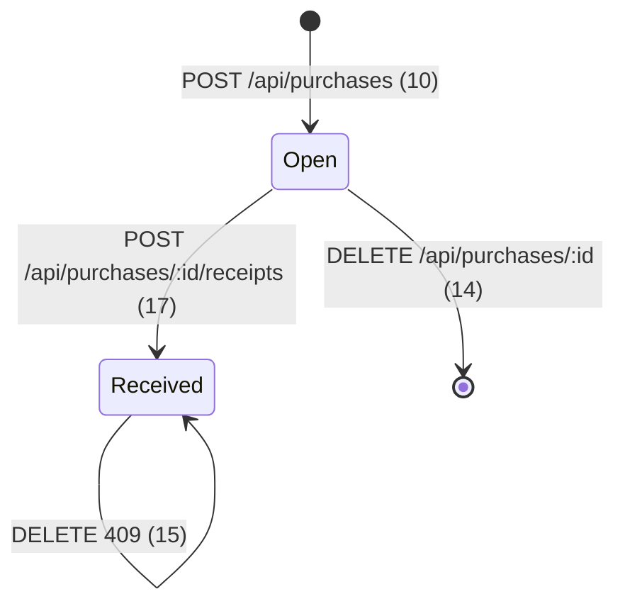
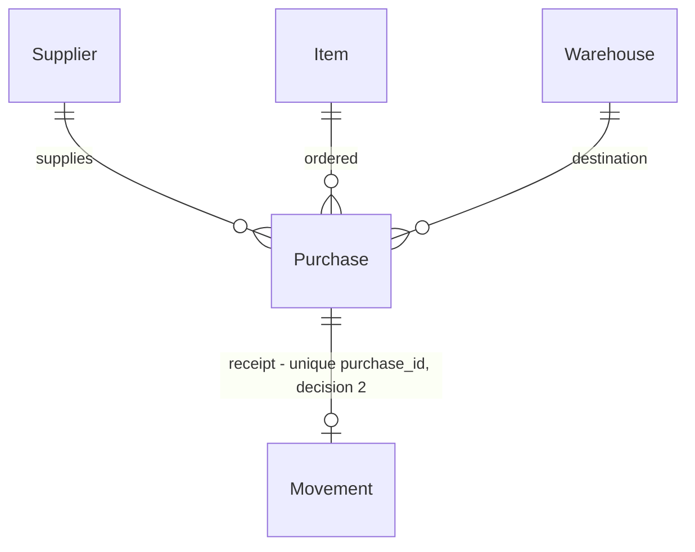

# Procurement

> Build this with **tlc-implement**.
> Every criterion below becomes a check with a proof, referenced by its number. Nothing under
> `Unresolved` gets settled while building.

## Intent

Hoje um Item só “é comprado” por um Receipt livre: `POST /api/receipts` já escreve Stock sem Supplier e sem Purchase. A Requisition da fase 7 transforma um pedido em Purchase — esse alvo não existe, e o loop da aula deixa “Item is bought” como stub. O produto não embarcou; o número que mudaria a aposta (quantas vezes um Purchase chega em dois Receipts) não existe.

Na tela Procurement, um User com sessão cria um Supplier, cria um Purchase que deixa `GET /api/stock` igual, e recebe esse Purchase — aí o Stock sobe. O Receipt livre continua na Inventory. Fonte da interface: [`.design/procurement.md`](../.design/procurement.md).

31 criteria in 4 slices · 3 one-way doors · 0 open, of which 0 block

## Criteria

### Supplier

1. Dado nenhuma linha de Supplier e um User com sessão, quando `GET /api/suppliers`, então `200` e `[]`.
2. Quando `POST /api/suppliers` com `{ "name": "Acme" }`, então `201` com UUID `id`, `name` `"Acme"`, ISO-8601 `createdAt`; `GET /api/suppliers` contém esse registro; `GET /api/purchases` continua `[]`; `GET /api/stock` é igual ao de antes do POST.
3. Quando `POST /api/suppliers` com `{ "name": "  Acme  " }`, então `201` e `name` é `"Acme"`.
4. Quando `POST /api/suppliers` com `name` em branco ou só whitespace, então `400` `{ "error": "name is required", "statusCode": 400 }` e `GET /api/suppliers` continua `[]`.
5. Dado um Supplier `"Acme"`, quando `POST /api/suppliers` com `{ "name": "Acme" }` de novo, então `409` `{ "error": "Supplier already exists", "statusCode": 409 }` e `GET /api/suppliers` ainda tem uma linha `"Acme"`.
6. Dado um Supplier sem Purchase, quando `DELETE /api/suppliers/:id`, então `204` e `GET /api/suppliers` não contém esse `id`.
7. Dado um id desconhecido, quando `DELETE /api/suppliers/:id`, então `404` `{ "error": "Supplier not found", "statusCode": 404 }`.
8. Dado um Supplier com Purchase, quando `DELETE /api/suppliers/:id`, então `409` `{ "error": "Supplier has Purchase", "statusCode": 409 }` e o Supplier permanece.

### Purchase

9. Dado nenhuma linha de Purchase e um User com sessão, quando `GET /api/purchases`, então `200` e `[]`.
10. Dado Supplier, Item e Warehouse existentes, quando `POST /api/purchases` com `supplierId`, `itemId`, `warehouseId` e `quantity` `12.5`, então `201` com UUID `id`, esses quatro campos, ISO-8601 `createdAt`, sem campo `status`; `GET /api/purchases` contém esse registro; `GET /api/stock` é igual ao de antes do POST.
11. Quando `POST /api/purchases` com `supplierId`, `itemId` ou `warehouseId` em branco, então `400` `{ "error": "supplierId, itemId, warehouseId, and a positive quantity are required", "statusCode": 400 }` e nenhum Purchase é gravado.
12. Quando `POST /api/purchases` com `quantity` ausente, não finita ou `<= 0`, então `400` `{ "error": "quantity must be a positive number", "statusCode": 400 }` e nenhum Purchase é gravado.
13. Quando `POST /api/purchases` com `supplierId`, `itemId` ou `warehouseId` que não existe, então `400` `{ "error": "Supplier, Item, or Warehouse not found", "statusCode": 400 }` e nenhum Purchase é gravado.
14. Dado um Purchase sem Movement, quando `DELETE /api/purchases/:id`, então `204`; `GET /api/purchases` não contém esse `id`; `GET /api/stock` é igual.
15. Dado um Purchase com Movement, quando `DELETE /api/purchases/:id`, então `409` `{ "error": "Purchase has Movement", "statusCode": 409 }`; o Purchase e o Movement permanecem; `GET /api/stock` é igual.
16. Dado um id desconhecido, quando `DELETE /api/purchases/:id`, então `404` `{ "error": "Purchase not found", "statusCode": 404 }`.

### Receipt from Purchase

17. Dado um Purchase com `quantity` `12.5` para um Item e um Warehouse, quando `POST /api/purchases/:id/receipts` sem body, então `201` com Movement `type` `receipt`, `quantity` `12.5`, `itemId` e `warehouseId` do Purchase, `purchaseId` igual ao Purchase, UUID `id`, ISO-8601 `createdAt`; `GET /api/stock` mostra essa quantity naquele Warehouse (cria a linha se não existia, soma se existia).
18. Dado esse Purchase já recebido, quando `POST /api/purchases/:id/receipts` de novo, então `409` `{ "error": "Purchase already received", "statusCode": 409 }`; nenhum Movement novo; `GET /api/stock` igual ao depois do primeiro receive. Impede o segundo write o unique em `movements.purchase_id`.
19. Dado um id desconhecido, quando `POST /api/purchases/:id/receipts`, então `404` `{ "error": "Purchase not found", "statusCode": 404 }` e nenhum Movement.
20. Quando `POST /api/receipts` com `warehouseId`, `itemId` e `quantity` válidos e sem Purchase, então `201`; o Movement tem `purchaseId` `null`; `GET /api/stock` sobe.
21. Sempre, um Movement `transfer` ou `issue`, e um Receipt livre, têm `purchaseId` `null`; `POST /api/transfers` e `POST /api/issues` devolvem o mesmo contrato de body e status de agora.
22. Quando `GET /api/suppliers`, `GET /api/purchases` ou `POST /api/purchases/:id/receipts` não tem sessão, então `401` `{ "error": "Unauthorized", "statusCode": 401 }`.
23. Dado um Operator com sessão, quando `POST /api/suppliers`, `POST /api/purchases` e `POST /api/purchases/:id/receipts` válidos, então cada um persiste e devolve `201`.
24. Quando dois `POST /api/purchases/:id/receipts` do mesmo Purchase correm juntos, então um é `201` e o outro é `409` `{ "error": "Purchase already received", "statusCode": 409 }`; existe um Movement; `GET /api/stock` subiu uma vez pela quantity do Purchase. Impede o segundo write o unique em `movements.purchase_id`.
25. Dado um Item referenciado só por um Purchase, sem Stock, quando `DELETE /api/items/:id`, então `409` `{ "error": "Item has Stock", "statusCode": 409 }` e o Item permanece.
26. Dado um Warehouse referenciado só por um Purchase, sem Stock, quando `DELETE /api/warehouses/:id`, então `409` `{ "error": "Warehouse has Stock", "statusCode": 409 }` e o Warehouse permanece.

### Procurement screen

27. Dado um User com sessão na tela Procurement, então há create de Supplier (`name`), create de Purchase (`supplierId`, `itemId`, `warehouseId`, `quantity`), delete em cada um, e o botão receive só no Purchase sem Movement.
28. Dado um User com sessão na tela Procurement, quando cria um Supplier, cria um Purchase e recebe esse Purchase, então a lista mostra o Supplier e o Purchase, o botão receive some nesse Purchase, e a tela Stock mostra a quantity aumentada pela quantity do Purchase. Depois do `POST /api/purchases` e antes do receive, a tela Stock estava igual.
29. A tela Inventory ainda tem os formulários Receipt, Transfer e Issue; um Receipt livre ainda devolve `201` e sobe Stock sem Purchase.
30. `CONTEXT.md` define **Supplier** e **Purchase** em inglês; o avoid de Receipt continua a rejeitar Purchase as this Movement.
31. `ROADMAP.md` lista a fase 5 Procurement em Done.

## States

Recebido = existe Movement com aquele `purchaseId`. Não há coluna de status. O Receipt livre (`20`) continua a escrever Stock sem entrar nesta máquina.

## Out of scope

- Staff and Assignment — fase 6; não destrava isto
- Requisition — fase 7; consome o Purchase
- Parcial, segundo Receipt, linhas, Warehouse diferente na doca — recusados no design
- Finance, RFQ, preço
- 403 — Job e Inventory são sessão sem Role
- Delete ou update de Movement
- Matar o Receipt livre
- PATCH de Purchase
- Número humano de Purchase — UUID
- Trocar as strings `Item has Stock` / `Warehouse has Stock` quando o FK é Purchase

## Observable

| Surface | Decision | Landing |
| --- | --- | --- |
| screen Procurement | empty | existing - Job/Warehouse: parágrafo vazio + formulário de create; o design não fixou o copy |
| screen Procurement | loading | existing - `App` devolve `null` até `/api/me` resolver |
| screen Procurement | error | existing - `
` com o `error` da API |
| screen Procurement | unauthorised | existing - tela Sign in; nav e Procurement não aparecem |
| screen Procurement | density and ordering | existing - `record-list` na ordem do array da API |
| screen Procurement | destructive confirm | existing - Delete dispara na hora, sem confirm (Job, Warehouse, Item) |
| screen Procurement | controls and receive | 27, 28 |
| screen Inventory | free Movements | 29 |
| screen Inventory | empty, loading, error | existing - inalterado |
| screen Stock | quantity after receive | 17, 28 |
| API `GET /api/suppliers` | response shape | 1, 2 |
| API `GET /api/suppliers` | error shape and codes | 22 |
| API `GET /api/suppliers` | who may call | 22, 23 |
| API `POST /api/suppliers` | response shape | 2, 3 |
| API `POST /api/suppliers` | error shape and codes | 4, 5, 22 |
| API `POST /api/suppliers` | who may call | 22, 23 |
| API `DELETE /api/suppliers/:id` | response shape | 6 |
| API `DELETE /api/suppliers/:id` | error shape and codes | 7, 8, 22 |
| API `DELETE /api/suppliers/:id` | who may call | 22, 23 |
| API `GET /api/purchases` | response shape | 9, 10 |
| API `GET /api/purchases` | error shape and codes | 22 |
| API `GET /api/purchases` | who may call | 22, 23 |
| API `POST /api/purchases` | response shape | 10 |
| API `POST /api/purchases` | error shape and codes | 11, 12, 13, 22 |
| API `POST /api/purchases` | who may call | 22, 23 |
| API `DELETE /api/purchases/:id` | response shape | 14 |
| API `DELETE /api/purchases/:id` | error shape and codes | 15, 16, 22 |
| API `DELETE /api/purchases/:id` | who may call | 22, 23 |
| API `POST /api/purchases/:id/receipts` | response shape | 17 |
| API `POST /api/purchases/:id/receipts` | error shape and codes | 18, 19, 22, 24 |
| API `POST /api/purchases/:id/receipts` | who may call | 22, 23 |
| API `POST /api/receipts` | response shape (`purchaseId` null) | 20, 21 |
| API `GET /api/movements` | response shape (`purchaseId`) | 17, 20, 21 |
| API all new `/api/suppliers`, `/api/purchases`, `/api/purchases/:id/receipts` | versioning | existing - `/api` sem versão, como Job |
| API all new | rate limit | n/a - classroom; não existe |
| document `CONTEXT.md` | structure, tone, depth | 30 |
| document `ROADMAP.md` | next: fase 5 em Done | 31 |
| collection suppliers | grouping | n/a - lista plana |
| collection suppliers | naming, duplicates | 3, 5 |
| collection suppliers | ordering | existing - ordem do `list` do repository |
| collection purchases | grouping | n/a - lista plana |
| collection purchases | naming | 10 - UUID `id`, sem número humano |
| collection purchases | duplicates | n/a - dois POST criam dois Purchase |
| collection purchases | ordering | existing - ordem do `list` do repository |
| command / webhook | — | n/a - nenhum |

## Swept

- validation: 4, 11, 12, 13
- failure modes: 7, 8, 15, 16, 18, 19
- idempotency and retry: 18
- authorization: 22, 23
- concurrency and ordering: 24
- data lifecycle: 6, 8, 14, 15, 25, 26
- external-dependency failure: n/a - SQLite local; sem remoto
- state transitions: 17, 18
- observability: n/a - classroom; sem contrato de métrica ou log, como Inventory

Create de Purchase não é idempotente: cada POST é um Purchase novo — o mesmo contrato de cada POST de Movement no Inventory.

## Impact

| Front | What changes |
|---|---|
| domain | new term: `Supplier` - the party a Purchase is placed with. Lives in `CONTEXT.md` and `/api/suppliers`. |
| domain | new term: `Purchase` - an order for one Item, one quantity, one Warehouse, from one Supplier. Does not write Stock. Lives in `CONTEXT.md` and `/api/purchases`. Receipt already avoids Purchase as this Movement; the term itself is not defined yet. |
| domain | existing term: `Receipt` meant only the free inbound Movement via `POST /api/receipts`. Now a Receipt also comes from `POST /api/purchases/:id/receipts`. Today `createReceipt` is called from `movementRoutes`, `movement.service.test.ts`, `movements.integration.test.ts`, and the Inventory screen. |
| domain | existing term: `Movement` record gains `purchaseId`. `MovementRecord`, `MovementRepository.apply`, `toMovement`, `createReceipt` / `createTransfer` / `createIssue`, unit fixtures that build a `MovementRecord`, and `GET /api/movements`. The Inventory screen reads `type`, Item, quantity, Warehouse — it ignores an extra field. |
| stored data | New tables: nothing to migrate. `movements.purchase_id` is nullable; existing Movement rows (if any) are all null and satisfy the unique. `apply-schema.ts` is `CREATE TABLE IF NOT EXISTS` — a classroom file already created without the column will not gain it; tests use a fresh temp SQLite. |

## Decided

| Decision | Shape | Alternative rejected |
|---|---|---|
| Purchase writes Stock? | No. Only `MovementService` writes Stock. `POST /api/purchases` leaves `GET /api/stock` unchanged. | Create of Purchase already does a Receipt — rejected because Requisition needs an order without goods. Closes “pedido ainda não chegou”. |
| Cardinalidade do receive | Um Receipt fecha o Purchase. Quantity e Warehouse saem do Purchase. `POST /api/purchases/:id/receipts` sem body. Unique em `movements.purchase_id` quando preenchido. Segundo receive → `409` `{ "error": "Purchase already received", "statusCode": 409 }`. | Parcial / remaining — se um Purchase chegar em dois caminhões. Trocar depois custa o unique e o formato de `purchases`. Fecha listar saldo restante. |
| Forma do Purchase | Um `itemId`, um `quantity` (`> 0`, finito), um `supplierId`, um `warehouseId`. Sem coluna de status. Recebido = existe Movement com aquele `purchaseId`. | Linhas, ou Warehouse só no Receipt — se a doca puder divergir do pedido. Fecha split e receive noutro Warehouse. |

## Relations

## Surface

| Route | In | Out | Status | Criteria |
|---|---|---|---|---|
| `GET /api/suppliers` | — | `id`, `name`, `createdAt`[] | `200`, `401` | 1, 2, 22 |
| `POST /api/suppliers` | `name` | `id`, `name`, `createdAt` | `201`, `400`, `401`, `409` | 2, 3, 4, 5, 22, 23 |
| `DELETE /api/suppliers/:id` | `id` | — | `204`, `401`, `404`, `409` | 6, 7, 8, 22 |
| `GET /api/purchases` | — | `id`, `supplierId`, `itemId`, `warehouseId`, `quantity`, `createdAt`[] | `200`, `401` | 9, 10, 22 |
| `POST /api/purchases` | `supplierId`, `itemId`, `warehouseId`, `quantity` | `id`, `supplierId`, `itemId`, `warehouseId`, `quantity`, `createdAt` | `201`, `400`, `401` | 10, 11, 12, 13, 22, 23 |
| `DELETE /api/purchases/:id` | `id` | — | `204`, `401`, `404`, `409` | 14, 15, 16, 22 |
| `POST /api/purchases/:id/receipts` | — | Movement com `purchaseId` | `201`, `401`, `404`, `409` | 17, 18, 19, 22, 23, 24 |
| `POST /api/receipts` | `warehouseId`, `itemId`, `quantity` | Movement com `purchaseId` `null` | `201`, `400`, `401` | 20, 21 |
| `GET /api/movements` | — | array com `purchaseId` | `200`, `401` | 17, 20, 21 |

## Sources

- [`.design/procurement.md`](../.design/procurement.md) - **binding for the interface**: tela Procurement — lista/cria/apaga Supplier e Purchase; botão receive no Purchase sem Movement; Receipt livre continua na Inventory. Journey, Boundary, Decisions (literal).
- [`CONTEXT.md`](../CONTEXT.md) - Receipt não é Purchase; Movement é o único writer de Stock.
- [`ROADMAP.md`](../ROADMAP.md) - fase 5 Supplier e Purchase; fase 7 espera Purchase.
- [`docs/specs/job.md`](../docs/specs/job.md) - trio, unique no índice, `name` trimmed, blank → `400` `name is required`, delete missing → `404`, sessão sem 403. Critérios 3, 4, 7, 16.
- [`apps/api/src/services/movement.service.ts`](../apps/api/src/services/movement.service.ts) - `createReceipt` é o writer do Receipt livre; molde das mensagens de quantity e ids em branco.
- [`apps/api/src/services/item.service.ts`](../apps/api/src/services/item.service.ts) / [`warehouse.service.ts`](../apps/api/src/services/warehouse.service.ts) - qualquer FK no delete já vira `409` `Item has Stock` / `Warehouse has Stock` (25, 26).
- [`apps/api/src/middleware/auth.ts`](../apps/api/src/middleware/auth.ts) - hook global `401` `Unauthorized` em tudo que não é `/health` ou `POST /api/login`.
- [`apps/web/src/App.tsx`](../apps/web/src/App.tsx) - um `Screen` union; empty/error/delete sem confirm; Inventory lê Movement sem `purchaseId`.

This task is the record of decision. If a linked document diverges, ask before building.

## Unresolved

| # | Kind | Question | Until answered |
|---|---|---|---|
| | | None | |
