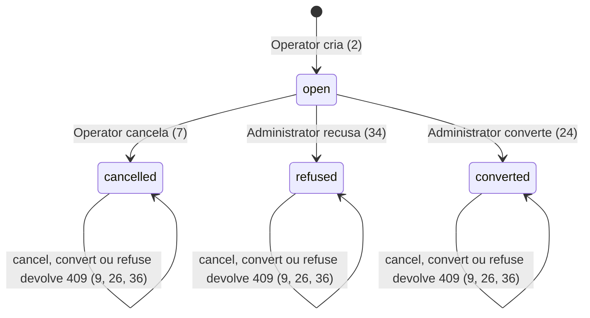
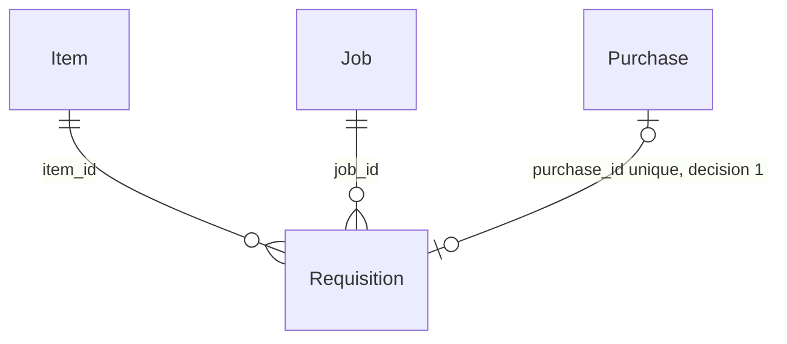

# Requisition

> Build this with **tlc-implement**.
> Every criterion below becomes a check with a proof, referenced by its number. Nothing under
> `Unresolved` gets settled while building.

## Intent

Hoje o Operator não registra que um Job precisa de um Item. Quem precisa da compra cria a Purchase direto, e essa Purchase não carrega o Job. O laço para em Issue e Assignment. Volume não medido: o projeto não está em uso. A fase 7 do ROADMAP é o último item aberto; nada depois está prometido.

O Operator abre uma Requisition na tela Requisition e pode cancelá-la. O Administrator converte essa linha numa Purchase, ou recusa. A Purchase continua sem escrever Stock. A interface vinculante está em [`.design/requisition.md`](../.design/requisition.md).

43 critérios em 4 fatias · 4 portas sem volta · 1 aberto, dos quais 0 bloqueiam

## Criteria

### Requisition

1. Dado que não existe Requisition, quando Operator ou Administrator chama `GET /api/requisitions`, então a resposta é 200 e o corpo é `[]`.
2. Dado Operator, um Item e um Job, quando `POST /api/requisitions` recebe `{ itemId, jobId, quantity: 12.5 }`, então a resposta é 201 e o corpo tem só as chaves `id`, `itemId`, `jobId`, `quantity`, `status`, `purchaseId`, `createdAt`, com `id` UUID, `quantity` 12.5, `status` `open`, `purchaseId` `null` e `createdAt` ISO-8601 em milissegundos terminado em `Z`. `GET /api/requisitions` como Operator e como Administrator devolve essa mesma linha. `GET /api/purchases` segue igual.
3. Dado Operator, quando `POST /api/requisitions` vem com `itemId` ou `jobId` vazio ou só com espaços, ou sem `quantity`, então a resposta é 400 `{ error: "itemId, jobId, and a positive quantity are required", statusCode: 400 }` e `GET /api/requisitions` segue `[]`.
4. Dado Operator, um Item e um Job, quando `quantity` é `0` ou `-1`, então a resposta é 400 `{ error: "quantity must be a positive number", statusCode: 400 }` e nada é gravado.
5. Dado Operator, quando `itemId` ou `jobId` não existe, então a resposta é 400 `{ error: "Item or Job not found", statusCode: 400 }` e nada é gravado.
6. Dado Administrator, quando `POST /api/requisitions` traz um `itemId` que não existe, então a resposta é 403 `{ error: "Forbidden", statusCode: 403 }` e `GET /api/requisitions` segue `[]`.
7. Dado Operator e uma Requisition `open`, quando `POST /api/requisitions/:id/cancel`, então a resposta é 200 com o mesmo corpo, `status` `cancelled` e `purchaseId` `null`. `GET /api/purchases`, `GET /api/stock` e `GET /api/movements` seguem iguais.
8. Dado Administrator, quando `POST /api/requisitions/:id/cancel` usa um id que não existe, então a resposta é 403 `{ error: "Forbidden", statusCode: 403 }` e a lista não muda.
9. Dado Operator e uma Requisition `cancelled`, `refused` ou `converted`, quando `POST /api/requisitions/:id/cancel`, então a resposta é 409 `{ error: "Requisition is not open", statusCode: 409 }` e `status` e `purchaseId` ficam como estavam.
10. Dado Operator, quando `POST /api/requisitions/:id/cancel` usa um id que não existe, então a resposta é 404 `{ error: "Requisition not found", statusCode: 404 }`.
11. Dado um Job apontado por uma Requisition, sem Movement e sem Assignment, quando `DELETE /api/jobs/:id`, então a resposta é 409 `{ error: "Job has Requisition", statusCode: 409 }` e o Job continua em `GET /api/jobs`.
12. Dado um Job com Movement e com Requisition, quando `DELETE /api/jobs/:id`, então a resposta é 409 `{ error: "Job has Movement", statusCode: 409 }` e o Job continua.
13. Dado um Job com Assignment e com Requisition, sem Movement, quando `DELETE /api/jobs/:id`, então a resposta é 409 `{ error: "Job has Assignment", statusCode: 409 }` e o Job continua.
14. Dado um Item apontado por uma Requisition e sem Stock, quando `DELETE /api/items/:id`, então a resposta é 409 `{ error: "Item has Requisition", statusCode: 409 }` e o Item continua em `GET /api/items`.
15. Dado um Item com Stock e com Requisition, quando `DELETE /api/items/:id`, então a resposta é 409 `{ error: "Item has Stock", statusCode: 409 }` e o Item continua.
16. Dado Operator e uma Requisition `open` para um Item e um Job, quando `POST /api/requisitions` repete o mesmo par, então a segunda resposta também é 201 `open` e `GET /api/requisitions` devolve as duas.
17. Dadas duas chamadas concorrentes de `POST /api/requisitions/:id/cancel` na mesma Requisition `open`, então uma responde 200 `cancelled` e a outra 409 `{ error: "Requisition is not open", statusCode: 409 }`. A linha fica `cancelled` com `purchaseId` `null`.
18. Dadas uma chamada de cancel do Operator e uma de convert do Administrator na mesma Requisition `open`, concorrentes, então uma responde 200 e a outra 409 `{ error: "Requisition is not open", statusCode: 409 }`. Se o 200 é `converted`, existe uma Purchase e `purchaseId` aponta para ela. Se o 200 é `cancelled`, não existe Purchase nova e `purchaseId` fica `null`.
19. Dado um User com sessão e nenhuma Requisition, quando abre a tela Requisition, então o nav e o heading dizem `Requisition` e a página mostra `No Requisition yet.`
20. Dado Operator, um Item e um Job, quando envia o formulário com Item, Quantity `12.5` e Job pelo botão `Create Requisition`, então a lista mostra uma linha com esse Item, a quantidade `12.5`, esse Job e o status `open`.
21. Dado Operator e essa linha `open`, quando aperta `Cancel`, então a linha passa a mostrar `cancelled`.
22. Dado Administrator, um Item e um Job, quando aperta `Create Requisition`, então o alerta mostra `Forbidden` e a lista segue vazia.
23. `CONTEXT.md` ganha o verbete: **Requisition** — the ask for one Item, one quantity, and one Job. It does not write Stock. Avoid: `pedido`, `Purchase` (as this ask).

### Convert Requisition

24. Dado Administrator e uma Requisition `open` com `quantity` 12.5, quando `POST /api/requisitions/:id/convert` recebe `{ supplierId, warehouseId, quantity: 1 }` com Supplier e Warehouse existentes, então a resposta é 200, `status` `converted` e `purchaseId` preenchido. A Purchase com esse id tem o `itemId` e a `quantity` 12.5 da Requisition, o `supplierId` e o `warehouseId` do corpo, e as chaves `id`, `supplierId`, `itemId`, `warehouseId`, `quantity`, `createdAt` — sem `jobId`. `GET /api/stock` e `GET /api/movements` seguem iguais. `GET /api/purchases` cresce em uma linha.
25. Dado Operator, quando `POST /api/requisitions/:id/convert` usa um id que não existe, então a resposta é 403 `{ error: "Forbidden", statusCode: 403 }` e `GET /api/purchases` não muda.
26. Dado Administrator e uma Requisition `cancelled`, `refused` ou `converted`, quando `POST /api/requisitions/:id/convert`, então a resposta é 409 `{ error: "Requisition is not open", statusCode: 409 }`, a linha não muda e não nasce Purchase.
27. Dadas duas chamadas concorrentes de `POST /api/requisitions/:id/convert` na mesma Requisition `open`, então uma responde 200 `converted` e a outra 409 `{ error: "Requisition is not open", statusCode: 409 }`. `GET /api/purchases` tem exatamente uma Purchase nova, e o `purchaseId` da linha é o id dela.
28. Dado Administrator, quando `POST /api/requisitions/:id/convert` usa um id que não existe, então a resposta é 404 `{ error: "Requisition not found", statusCode: 404 }`.
29. Dado Administrator e uma Requisition `open`, quando `supplierId` ou `warehouseId` vem vazio, só com espaços, ou não existe, então a resposta é 400 `{ error: "Supplier or Warehouse not found", statusCode: 400 }`, o `status` continua `open` e não nasce Purchase.
30. Sempre, Requisition `converted` tem `purchaseId` igual ao `id` de uma Purchase existente; Requisition `open`, `refused` ou `cancelled` tem `purchaseId` `null`.
31. Dado o convert do critério 24, quando o User abre Procurement, então a lista de Purchase mostra essa Purchase com a quantidade `12.5`.
32. Dado Administrator e uma linha `open`, quando escolhe Supplier e Warehouse e aperta `Convert`, então a linha mostra `converted`.
33. Dado Operator e uma linha `open`, quando aperta `Convert`, então o alerta mostra `Forbidden` e a linha continua `open`.

### Refuse Requisition

34. Dado Administrator e uma Requisition `open`, quando `POST /api/requisitions/:id/refuse`, então a resposta é 200, `status` `refused` e `purchaseId` `null`. `GET /api/purchases`, `GET /api/stock` e `GET /api/movements` seguem iguais.
35. Dado Operator, quando `POST /api/requisitions/:id/refuse` usa um id que não existe, então a resposta é 403 `{ error: "Forbidden", statusCode: 403 }` e a lista não muda.
36. Dado Administrator e uma Requisition `cancelled`, `refused` ou `converted`, quando `POST /api/requisitions/:id/refuse`, então a resposta é 409 `{ error: "Requisition is not open", statusCode: 409 }` e a linha não muda.
37. Dado Administrator, quando `POST /api/requisitions/:id/refuse` usa um id que não existe, então a resposta é 404 `{ error: "Requisition not found", statusCode: 404 }`.
38. Dadas duas chamadas concorrentes de `POST /api/requisitions/:id/refuse` na mesma Requisition `open`, então uma responde 200 `refused` e a outra 409 `{ error: "Requisition is not open", statusCode: 409 }`. A linha fica `refused` com `purchaseId` `null` e não nasce Purchase.
39. Dadas uma chamada de convert e uma de refuse na mesma Requisition `open`, concorrentes, então uma responde 200 e a outra 409 `{ error: "Requisition is not open", statusCode: 409 }`. Se o 200 é `converted`, existe uma Purchase e `purchaseId` aponta para ela. Se o 200 é `refused`, não existe Purchase nova e `purchaseId` fica `null`.
40. Dado Administrator e uma linha `open`, quando aperta `Refuse`, então a linha mostra `refused` e Procurement não ganha Purchase.

### Purchase

41. Dado uma Purchase com Movement, com ou sem Requisition apontando para ela, quando `DELETE /api/purchases/:id`, então a resposta é 409 `{ error: "Purchase has Movement", statusCode: 409 }` e a Purchase continua.
42. Dado uma Purchase sem Movement e com Requisition apontando para ela, quando `DELETE /api/purchases/:id`, então a resposta é 409 `{ error: "Purchase has Requisition", statusCode: 409 }` e a Purchase e a Requisition continuam.
43. Dado uma Purchase sem Movement e sem Requisition, quando `DELETE /api/purchases/:id`, então a resposta é 204 e `GET /api/purchases` não a contém.

## States

## Out of scope

- Receipt e Stock na conversão — o Receipt existente continua sendo quem aumenta Stock.
- Issue no lugar da Purchase — Stock que já existe continua sendo Issue.
- Editar Item, quantidade ou Job em `open` — cancelar e criar outra.
- Quantidade parcial — a quantidade é copiada inteira.
- Guardar o User que pediu — a lista não mostra quem pediu.
- Prazo de validade — não há.
- RFQ e comparação de Supplier — fora do roadmap.
- Índice único de Item e Job em `open` — um segundo pedido aberto do mesmo par continua valendo (16).
- Role nas rotas que já existem — a checagem nova para em criar, cancelar, converter e recusar.

## Observable

| Surface | Decision | Landing |
| --- | --- | --- |
| screen Requisition | empty state | 19 |
| screen Requisition | loading | existing — `ready` falso renderiza `null` até `GET /api/me` |
| screen Requisition | error state | 22, 33 — o alerta é o `p role="alert"` que já mostra `body.error` |
| screen Requisition | unauthorised | existing — 401 zera a sessão e volta para Sign in |
| screen Requisition | density and ordering | n/a — a lista não tem ordem explícita, como o `select()` de Purchase; uma linha por Requisition |
| screen Requisition | destructive action confirms | existing — Delete não pede confirmação; Cancel, Convert e Refuse também não |
| screen Procurement | empty state | existing — `No Purchase yet.` |
| screen Procurement | loading | existing — o mesmo `ready` |
| screen Procurement | error state | existing — `p role="alert"` mostra `body.error`, inclusive `Purchase has Requisition` |
| screen Procurement | unauthorised | existing — 401 zera a sessão |
| screen Procurement | density and ordering | 31 — a Purchase convertida entra na lista que já existe |
| screen Procurement | destructive action confirms | existing — Delete não pede confirmação |
| screen Job | destructive action confirms | existing — Delete não pede confirmação; o texto do 409 é 11, 12, 13 |
| screen Catalog | destructive action confirms | existing — Delete não pede confirmação; o texto do 409 é 14, 15 |
| API `GET /api/requisitions` | response shape | 1, 2 |
| API `GET /api/requisitions` | error shape and codes | existing — sem sessão, `registerAuth` responde 401 `{ error: "Unauthorized", statusCode: 401 }` |
| API `GET /api/requisitions` | who may call | 1, 2 — qualquer User com sessão |
| API `GET /api/requisitions` | versioning | n/a — as rotas não têm versão |
| API `GET /api/requisitions` | rate limit | n/a — a API não limita taxa |
| API `POST /api/requisitions` | response shape | 2 |
| API `POST /api/requisitions` | error shape and codes | 3, 4, 5, 6 |
| API `POST /api/requisitions` | who may call | 2, 6 |
| API `POST /api/requisitions` | versioning | n/a — as rotas não têm versão |
| API `POST /api/requisitions` | rate limit | n/a — a API não limita taxa |
| API `POST /api/requisitions/:id/cancel` | response shape | 7 |
| API `POST /api/requisitions/:id/cancel` | error shape and codes | 8, 9, 10 |
| API `POST /api/requisitions/:id/cancel` | who may call | 7, 8 |
| API `POST /api/requisitions/:id/cancel` | versioning | n/a — as rotas não têm versão |
| API `POST /api/requisitions/:id/cancel` | rate limit | n/a — a API não limita taxa |
| API `POST /api/requisitions/:id/convert` | response shape | 24 |
| API `POST /api/requisitions/:id/convert` | error shape and codes | 25, 26, 28, 29 |
| API `POST /api/requisitions/:id/convert` | who may call | 24, 25 |
| API `POST /api/requisitions/:id/convert` | versioning | n/a — as rotas não têm versão |
| API `POST /api/requisitions/:id/convert` | rate limit | n/a — a API não limita taxa |
| API `POST /api/requisitions/:id/refuse` | response shape | 34 |
| API `POST /api/requisitions/:id/refuse` | error shape and codes | 35, 36, 37 |
| API `POST /api/requisitions/:id/refuse` | who may call | 34, 35 |
| API `POST /api/requisitions/:id/refuse` | versioning | n/a — as rotas não têm versão |
| API `POST /api/requisitions/:id/refuse` | rate limit | n/a — a API não limita taxa |
| API `DELETE /api/purchases/:id` | error shape and codes | 41, 42, 43 |
| API `DELETE /api/jobs/:id` | error shape and codes | 11, 12, 13 |
| API `DELETE /api/items/:id` | error shape and codes | 14, 15 |

## Swept

- validation: 3, 4, 5, 29
- failure modes: 9, 10, 26, 28, 36, 37, 41, 42
- idempotency and retry: 16 — um segundo POST cria outra `open`; 9, 26, 36 — repetir uma transição terminal devolve 409 e não grava de novo
- authorization: 6, 8, 25, 35 — Role errado é 403 antes de ler a Requisition; sem sessão continua no `registerAuth`
- concurrency and ordering: 17, 18, 27, 38, 39
- data lifecycle: 11, 14, 42 — Job, Item e Purchase permanecem enquanto uma Requisition os aponta; a linha da Requisition não tem exclusão
- external-dependency failure: n/a — não há serviço remoto; o banco é SQLite local
- state transitions: 7, 24, 26, 30, 34, 36
- observability: n/a — a fonte não pede métrica nem auditoria; erro 5xx já passa por `registerErrorHandler`

## Impact

| Front | What changes |
|---|---|
| domain | new term: `Requisition` — o pedido de um Item, uma quantidade e um Job; não escreve Stock. Entra em `CONTEXT.md` |
| domain | existing term: `Purchase` continua uma ordem de um Item, uma quantidade, um Warehouse e um Supplier, e continua sem escrever Stock. Quem compara o erro com `Purchase has Movement` segue vendo essa frase quando existe Movement (41). O apagamento também para quando uma Requisition aponta a Purchase (42) |
| domain | existing term: `Job` continua o work site. `Job has Movement` e `Job has Assignment` seguem quando essas linhas existem (12, 13). Some a frase `Job has Requisition` |
| domain | existing term: `Item` continua o material do catálogo. `Item has Stock` segue quando existe Stock (15). Some a frase `Item has Requisition` só sem Stock (14) |
| stored data | tabela nova `requisitions`, vazia. Nada para migrar: o projeto não está em uso e nenhuma tabela existente ganha coluna |

## Decided

| Decision | Shape | Alternative rejected |
|---|---|---|
| O vínculo mora na Requisition | `requisitions.status` em `open`, `converted`, `refused`, `cancelled`. `requisitions.purchase_id` nulo, referencia `purchases.id`, índice único `requisitions_purchase_id_unique` (vários nulos convivem). `requisitions.job_id` referencia `jobs.id` e não existe em `purchases`. Nenhuma tabela existente ganha coluna | Status na Purchase — uma Purchase direta pode existir sem Requisition |
| Converter é um commit só, e a linha `open` só muda uma vez | `BEGIN`; insere a Purchase; grava `converted` e `purchase_id` só se `status` ainda é `open`; senão `ROLLBACK` e nenhuma Purchase fica. Cancel e refuse também só vencem se a linha ainda está `open`. A perdida responde 409 `Requisition is not open` | Gravar a Purchase sozinha e o status depois — o intervalo deixa Purchase sem `converted`, ou `converted` sem Purchase |
| Role barra quatro escritas | Operator cria e cancela. Administrator converte e recusa. Role errado: 403 `{ error: "Forbidden", statusCode: 403 }` antes de ler a Requisition. Listar: qualquer sessão. O resto da API segue só com sessão | Checar Role só na tela — a API aceitaria o Role errado |
| A razão do apagamento nomeia a referência | Purchase: Movement, depois Requisition. Job: Movement, depois Assignment, depois Requisition. Item: Stock, depois Requisition | Item mapeia toda foreign key para `Item has Stock` — uma Requisition seria dita Stock |

## Relations

## Surface

| Route | In | Out | Status | Criteria |
|---|---|---|---|---|
| `GET /api/requisitions` | sessão | `Requisition[]` | 200 | 1, 2 |
| `POST /api/requisitions` | `itemId`, `jobId`, `quantity` | `id`, `itemId`, `jobId`, `quantity`, `status`, `purchaseId`, `createdAt` | 201, 400, 403 | 2, 3, 4, 5, 6 |
| `POST /api/requisitions/:id/cancel` | sessão | o mesmo corpo | 200, 403, 404, 409 | 7, 8, 9, 10 |
| `POST /api/requisitions/:id/convert` | `supplierId`, `warehouseId` | o mesmo corpo | 200, 400, 403, 404, 409 | 24, 25, 26, 28, 29 |
| `POST /api/requisitions/:id/refuse` | sessão | o mesmo corpo | 200, 403, 404, 409 | 34, 35, 36, 37 |
| `DELETE /api/purchases/:id` | sessão | vazio no 204 | 204, 409 | 41, 42, 43 |
| `DELETE /api/jobs/:id` | sessão | vazio no 204 | 409 | 11, 12, 13 |
| `DELETE /api/items/:id` | sessão | vazio no 204 | 409 | 14, 15 |

## Sources

- [`.design/requisition.md`](../.design/requisition.md) — **vinculante para a interface**: tela Requisition (formulário, lista, status, Cancel) e os contratos HTTP. A frase que copiava o Job para a Purchase foi corrigida: `job_id` fica na Requisition. Trim, quantidade positiva, `200 []`, corpo 201, lista sem ordem e a cópia vazia ficam como Purchase já faz: `itemId, jobId, and a positive quantity are required`, `quantity must be a positive number`, `No Requisition yet.`
- [`ROADMAP.md`](../ROADMAP.md) — fase 7: o Operator pede um Item para um Job e o Administrator transforma isso numa Purchase
- [`CONTEXT.md`](../CONTEXT.md) — Purchase não escreve Stock; Role é Administrator ou Operator

Esta tarefa é o registro da decisão. Se um documento ligado divergir, pergunte antes de construir.

## Unresolved

| # | Kind | Question | Until answered |
|---|---|---|---|
| 1 | open | A tela Requisition leva `Convert` (Supplier e Warehouse) e `Refuse`, ou esses dois ficam só na API? | 19–22, 32, 33 e 40 assumem nav `Requisition`, botões `Create Requisition`, `Cancel`, `Convert` e `Refuse`, visíveis para os dois Roles. O 403 aparece no alerta. Se a resposta for API-only, derrube 32, 33 e 40. |
